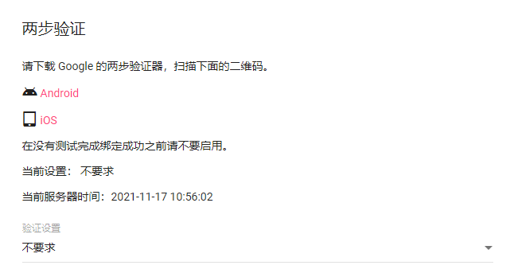

# CordCloud Action

<a href="https://github.com/yanglbme/cordcloud-action/actions"></a> <a href="./LICENSE"></a> <a href="../../releases"></a>

CordCloud 帐号自动续命。可配置 workflow 的触发条件为 `schedule`，实现每日自动签到，领取流量续命。

## 入参

| 参数     | 描述                | 是否必传 | 默认值           | 示例                       |
| -------- | ------------------- | -------- | ---------------- | -------------------------- |
| `email`  | 你的 CordCloud 邮箱 | 是       |                  | `${{ secrets.CC_EMAIL }}`  |
| `passwd` | 你的 CordCloud 密码 | 是       |                  | `${{ secrets.CC_PASSWD }}` |
| `host`   | CordCloud 站点      | 否       | `cordcloud.site` | `cordcloud.site`           |


注意：使用此 CordCloud Action 前，请关闭两步验证，即把验证设置为“不要求”。



## 完整示例

在你的任意一个 GitHub 仓库 `.github/workflows/` 文件夹下创建一个 `.yml` 文件，如 `cc.yml`，内容如下：

```yml
name: CordCloud

on:
  schedule:
    - cron: "0 0 * * *"
  workflow_dispatch:

jobs:
  checkin:
    runs-on: ubuntu-latest
    steps:
      - uses: yanglbme/cordcloud-action@main
        with:
          email: ${{ secrets.CC_EMAIL }}
          passwd: ${{ secrets.CC_PASSWD }}
          host: cordcloud.site
```

同时，在 GitHub 仓库的 `Settings -> Secrets` 路径下配置好 `CC_EMAIL` 与 `CC_PASSWD` ，不要直接在 `.yml` 文件中暴露个人帐号密码等敏感信息。


注意：`cron` 是 UTC 时间，使用时请将北京时间转换为 UTC 进行配置。由于 GitHub Actions 的限制，如果将 `cron` 表达式设置为 `* * * * *`，则实际的执行频率为每 5 分钟执行一次。

```bash
┌───────────── 分钟 (0 - 59)
│ ┌───────────── 小时 (0 - 23)
│ │ ┌───────────── 日 (1 - 31)
│ │ │ ┌───────────── 月 (1 - 12 或 JAN-DEC)
│ │ │ │ ┌───────────── 星期 (0 - 6 或 SUN-SAT)
│ │ │ │ │
│ │ │ │ │
│ │ │ │ │
* * * * *
```

实际上，你只需要跟示例一样，将 `cron` 表达式设置为每天运行一次即可。
