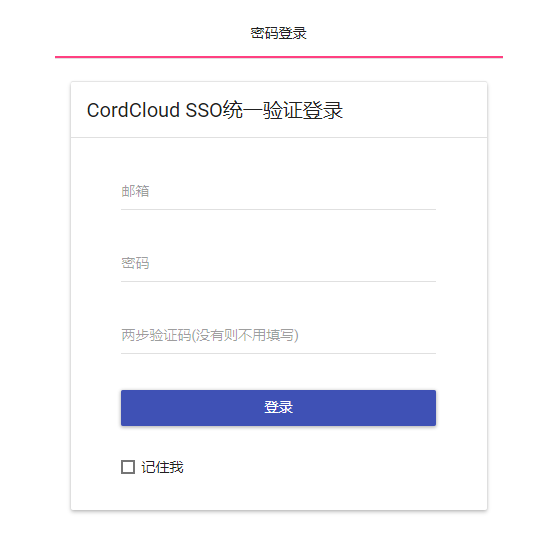
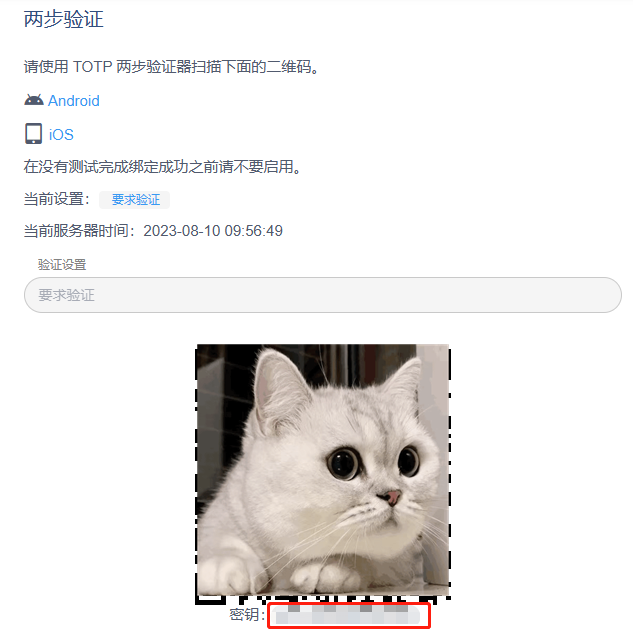
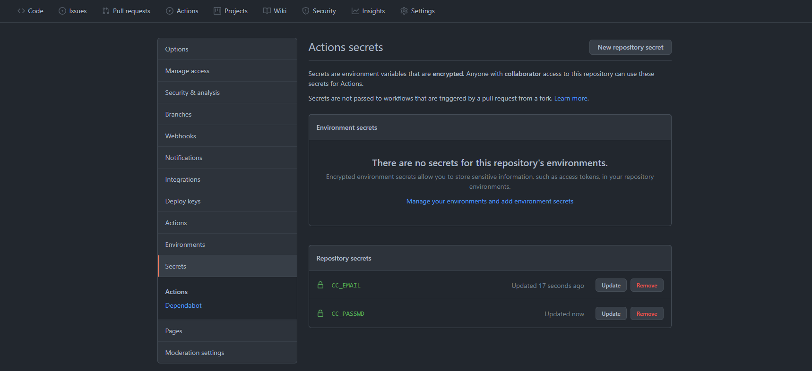
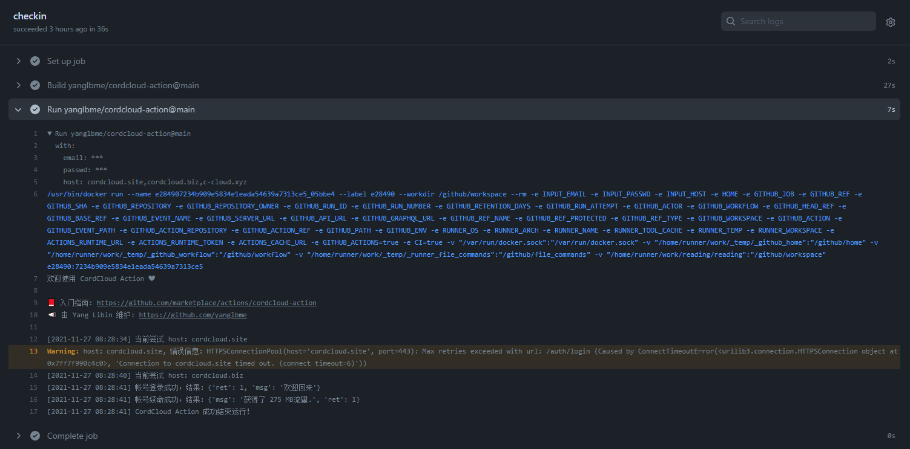

# CordCloud Action

<a href="./LICENSE"></a> <a href="../../releases"></a>

CordCloud 帐号自动续命。可配置 workflow 的触发条件为 `schedule`，实现每日自动签到，领取流量续命。

欢迎 Star ⭐ 关注[本项目](https://github.com/yanglbme/cordcloud-action)，若有体验上的问题，欢迎提交 issues 反馈给我。你也可以将本项目 Fork
到你的个人帐号下，进行自定义扩展。

## 入参

| 参数     | 描述                   | 是否必传 | 默认值                                                   | 示例                      |
| -------- | ---------------------- | -------- | -------------------------------------------------------- | ------------------------- |
| `email`  | CordCloud 邮箱         | 是       |                                                          | \${{ secrets.CC_EMAIL }}  |
| `passwd` | CordCloud 密码         | 是       |                                                          | \${{ secrets.CC_PASSWD }} |
| `secret` | CordCloud 两步验证密钥 | 否       |                                                          | \${{ secrets.CC_SECRET }} |
| `host`   | CordCloud 站点         | 否       | cordcloud.us,cordcloud.one,<br>cordcloud.biz,c-cloud.xyz |                           |

注：

- `host` 支持以英文逗号分隔传入多个站点，CordCloud Action 会依次尝试每个站点，成功即停止。若是遇到帐号或密码错误，则不会继续尝试剩余站点。
- 如果你设置了两步验证，需要将两步验证的密钥传入，否则无法正常签到。





## 完整示例

### 1. 创建 workflow

在你的任意一个 GitHub 仓库 `.github/workflows/` 文件夹下创建一个 `.yml` 文件，如 `cc.yml`，内容如下：

```yml
name: CordCloud

on:
  schedule:
    - cron: "0 0 * * *"
  workflow_dispatch:

jobs:
  checkin:
    runs-on: ubuntu-latest
    steps:
      - uses: yanglbme/cordcloud-action@main
        with:
          email: ${{ secrets.CC_EMAIL }}
          passwd: ${{ secrets.CC_PASSWD }}
```

如果你设置了两步验证，需要将两步验证的密钥传入，否则无法完成登录签到。示例如下：

```yml
name: CordCloud

on:
  schedule:
    - cron: "0 0 * * *"
  workflow_dispatch:

jobs:
  checkin:
    runs-on: ubuntu-latest
    steps:
      - uses: yanglbme/cordcloud-action@main
        with:
          email: ${{ secrets.CC_EMAIL }}
          passwd: ${{ secrets.CC_PASSWD }}
          secret: ${{ secrets.CC_SECRET }}
```

注意：`cron` 是 UTC 时间，使用时请将北京时间转换为 UTC 进行配置。由于 GitHub Actions 的限制，如果将 `cron` 表达式设置为 `* * * * *`，则实际的执行频率为每 5 分钟执行一次。

```bash
┌───────────── 分钟 (0 - 59)
│ ┌───────────── 小时 (0 - 23)
│ │ ┌───────────── 日 (1 - 31)
│ │ │ ┌───────────── 月 (1 - 12 或 JAN-DEC)
│ │ │ │ ┌───────────── 星期 (0 - 6 或 SUN-SAT)
│ │ │ │ │
│ │ │ │ │
│ │ │ │ │
* * * * *
```

实际上，一般情况下，你只需要跟示例一样，将 `cron` 表达式设置为**每天定时运行一次**即可。如果担心 CordCloud 官网某次恰好发生故障而无法完成自动签到，可以将 `cron` 表达式设置为一天运行 2 次或者更多次。

### 2. 配置 secrets 参数

在 GitHub 仓库的 `Settings -> Secrets` 路径下配置好 `CC_EMAIL` 与 `CC_PASSWD` ，不要直接在 `.yml` 文件中暴露个人帐号密码以及密钥等敏感信息。

如果你设置了两步验证，注意还需要配置 `CC_SECRET` 参数。



### 3. 每日运行结果

若 CordCloud Action 所需参数 `email`、`passwd` 等配置无误，CordCloud Action 将会根据触发条件（比如 `schedule`）自动运行，结果如下：



```bash
Run yanglbme/cordcloud-action@main
  with:
    email: ***
    passwd: ***
    secret: ***
    host: cordcloud.us,cordcloud.one,cordcloud.biz,c-cloud.xyz
/usr/bin/docker run --name bedb45d362fa3d3b44c97b19a4a9aff834955_0c4091 --label 5bedb4 --workdir /github/workspace --rm -e "INPUT_EMAIL" -e "INPUT_PASSWD" -e "INPUT_SECRET" -e "INPUT_HOST" -e "HOME" -e "GITHUB_JOB" -e "GITHUB_REF" -e "GITHUB_SHA" -e "GITHUB_REPOSITORY" -e "GITHUB_REPOSITORY_OWNER" -e "GITHUB_REPOSITORY_OWNER_ID" -e "GITHUB_RUN_ID" -e "GITHUB_RUN_NUMBER" -e "GITHUB_RETENTION_DAYS" -e "GITHUB_RUN_ATTEMPT" -e "GITHUB_REPOSITORY_ID" -e "GITHUB_ACTOR_ID" -e "GITHUB_ACTOR" -e "GITHUB_TRIGGERING_ACTOR" -e "GITHUB_WORKFLOW" -e "GITHUB_HEAD_REF" -e "GITHUB_BASE_REF" -e "GITHUB_EVENT_NAME" -e "GITHUB_SERVER_URL" -e "GITHUB_API_URL" -e "GITHUB_GRAPHQL_URL" -e "GITHUB_REF_NAME" -e "GITHUB_REF_PROTECTED" -e "GITHUB_REF_TYPE" -e "GITHUB_WORKFLOW_REF" -e "GITHUB_WORKFLOW_SHA" -e "GITHUB_WORKSPACE" -e "GITHUB_ACTION" -e "GITHUB_EVENT_PATH" -e "GITHUB_ACTION_REPOSITORY" -e "GITHUB_ACTION_REF" -e "GITHUB_PATH" -e "GITHUB_ENV" -e "GITHUB_STEP_SUMMARY" -e "GITHUB_STATE" -e "GITHUB_OUTPUT" -e "RUNNER_OS" -e "RUNNER_ARCH" -e "RUNNER_NAME" -e "RUNNER_ENVIRONMENT" -e "RUNNER_TOOL_CACHE" -e "RUNNER_TEMP" -e "RUNNER_WORKSPACE" -e "ACTIONS_RUNTIME_URL" -e "ACTIONS_RUNTIME_TOKEN" -e "ACTIONS_CACHE_URL" -e GITHUB_ACTIONS=true -e CI=true -v "/var/run/docker.sock":"/var/run/docker.sock" -v "/home/runner/work/_temp/_github_home":"/github/home" -v "/home/runner/work/_temp/_github_workflow":"/github/workflow" -v "/home/runner/work/_temp/_runner_file_commands":"/github/file_commands" -v "/home/runner/work/reading/reading":"/github/workspace" 5bedb4:5d362fa3d3b44c97b19a4a9aff834955
[2023-08-10 10:20:33] 欢迎使用 CordCloud Action ❤

📕 入门指南: https://github.com/marketplace/actions/cordcloud-action
📣 由 Yang Libin 维护: https://github.com/yanglbme

[2023-08-10 10:20:33] 当前尝试 host：cordcloud.us
[2023-08-10 10:20:33] 尝试帐号登录，结果：登录成功
[2023-08-10 10:20:33] 尝试帐号签到，结果：您似乎已经签到过了...
[2023-08-10 10:20:34] 帐号流量使用情况：今日已用 121.22MB, 过去已用 162.02GB, 剩余流量 688.62GB
[2023-08-10 10:20:34] CordCloud Action 成功结束运行！
```
