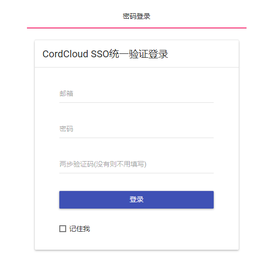
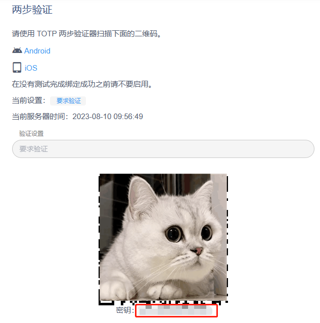
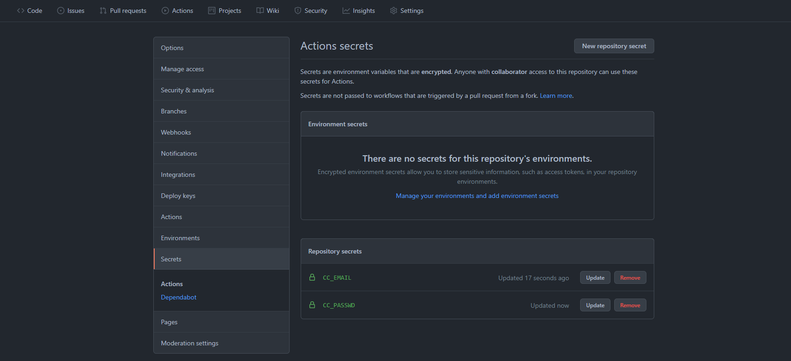
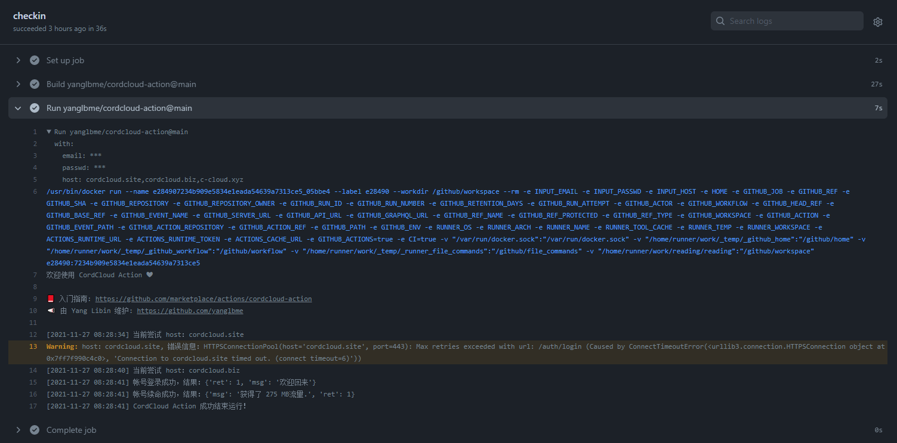

# CordCloud Action

<a href="./LICENSE"></a> <a href="../../releases"></a>

CordCloud 帐号自动续命。可配置 workflow 的触发条件为 `schedule`，实现每日自动签到，领取流量续命。

欢迎 Star ⭐ 关注[本项目](https://github.com/opcwj/cordcloud-action)，若有体验上的问题，欢迎提交 issues 反馈给我。你也可以将本项目 Fork
到你的个人帐号下，进行自定义扩展。

本项目基于[yanglbme/cordcloud-action](https://github.com/yanglbme/cordcloud-action)修改，在此特别鸣谢！！因CordCloud登录签到验证逻辑改变，故此修改。

## 入参

| 参数     | 描述                   | 是否必传                                                                                                                                          | 默认值                                                   | 示例                      |
| -------- | ---------------------- |---------------------------------------------------------------------------------------------------------------------------------------------------| -------------------------------------------------------- | ------------------------- |
| `email`  | CordCloud 邮箱         | 是                                                                                                                                                |                                                          | \${{ secrets.CC_EMAIL }}  |
| `passwd` | CordCloud 密码         | 是                                                                                                                                                |                                                          | \${{ secrets.CC_PASSWD }} |
| `secret` | CordCloud 两步验证密钥 | 否                                                                                                                                                |                                                          | \${{ secrets.CC_SECRET }} |
| `host`   | CordCloud 站点         | 否                                                                                                                                                | cordcloud.us,cordcloud.one,<br>cordcloud.biz,c-cloud.xyz,cordc.xyz |                           |
| `device_code` | 陌生设备邮箱验证码（仅首次触发时需填一次） | 否                                                                                                                                                |                                                          |                           |
| `device_token` | 首次触发时日志输出的验证 token（与 `device_code` 一起填，避免重发验证码作废旧码） | 否                                                                                                                                                |                                                          |                           |
| `device_fingerprint` | 自定义设备指纹（可复用已验证过的值） | 否                                                                                                                                                | 由邮箱生成的稳定指纹                                    |                           |
| `imap_host` | IMAP 服务器（留空则按邮箱域名自动识别） | 否                                                                                                                                                | 自动识别                                              | imap.gmail.com            |
| `imap_port` | IMAP 端口 | 否                                                                                                                                                | 993                                                    |                           |
| `imap_user` | IMAP 用户名（默认用邮箱） | 否                                                                                                                                                | 邮箱                                                   |                           |
| `imap_password` | IMAP 密码/应用专用密码（用于自动读取验证码） | 否（**推荐填写，用于自动读取邮箱验证码并提交验证。避免需要验证码验证时登录失败而无法签到，省去设备过期需要手动配置邮箱验证码device_code的时间**） |                                                          | \${{ secrets.CC_IMAP_PWD }} |
| `imap_timeout` | IMAP 自动读取验证码的超时时间（秒） | 否                                                                                                                                                | 120                                                    |                           |

注：

- **全自动（推荐）**：配置 `imap_password`（邮箱 IMAP 密码/应用专用密码）后，触发陌生设备验证时会**自动从邮箱读取验证码并完成验证**，无需手动填写 `device_code`，一次运行即可完成登录+签到。注意：Gmail 等需使用应用专用密码，并确保邮箱已开启 IMAP 服务。
最简配置可直接参考仓库中的 [`action-simple.yml`](./action-simple.yml)（只需配置邮箱、密码与 IMAP 密码即可全自动签到）！！！


--- 
**【签到有问题，或想深入了解的可继续阅读下文】**

- `host` 支持以英文逗号分隔传入多个站点，CordCloud Action 会依次尝试每个站点，成功即停止。若是遇到帐号或密码错误，则不会继续尝试剩余站点。
- 如果你设置了两步验证，需要将两步验证的密钥传入，否则无法正常签到。
- **陌生设备验证（一次性）**：CordCloud 会根据 `device_fingerprint` 识别设备。Action 默认使用由邮箱生成的稳定指纹，跨机器、跨时间恒定。首次运行时若服务器识别为陌生设备（`检测到陌生设备，需要进行二步验证`），会向邮箱发送验证码，此时只需将验证码填入 `device_code` 再运行一次即可。验证成功后该指纹将被永久信任，之后**永不再触发**验证。
- **注意**：首次触发后会向邮箱发送验证码并保存一个 `token`。请在**下一次运行前**设置好 `device_code`（必要时同时设置 `device_token`），**期间不要再次运行**，否则每次登录都会重发验证码并作废前一个验证码。成功验证后 token 会自动清除。





## 本地调试

本地运行 `main.py` 时，GitHub Actions 的输入参数是通过环境变量（如 `INPUT_EMAIL`）传入的，逐项设置比较麻烦。可以在当前目录下创建 `config.json`（参考 [`config.example.json`](./config.example.json)），程序会自动读取，无需再设置环境变量：

```json
{
  "email": "your@email.com",
  "passwd": "your_password",
  "secret": "",
  "host": "cordcloud.us,cordcloud.one,cordcloud.biz,c-cloud.xyz,cordc.xyz",
  "imap_password": "",
  "imap_timeout": 120
}
```

参数优先级为：`config.json` > 环境变量。`config.json` 中可配置的参数与上方入参表一一对应（`imap_port`、`imap_timeout` 为数字类型）。也可通过环境变量 `CC_CONFIG` 指定配置文件路径。

注意：

- `config.json` 包含敏感信息，已被加入 `.gitignore`，请勿提交到仓库。
- 在 GitHub Actions 环境中（`GITHUB_ACTIONS=true`）会**自动忽略**配置文件，只使用 Secrets 传入的参数，确保 CI 环境安全。

## 登录与签到逻辑

### 登录

1. 访问登录页，从 HTML 中提取 `csrf_token`；
2. 请求 Altcha 验证挑战，本地计算 `SHA256(salt + number) == challenge` 求解工作量证明，并 Base64 编码；
3. 组装登录表单（`email`、`passwd`、`altcha`、`csrf_token`、`device_fingerprint`、`remember_me`，配置两步验证时再加 `code`），POST `/auth/login`；
4. 响应 `ret == 1` 表示登录成功；`ret == 2` 表示服务器识别为陌生设备，需要邮箱二步验证。

### 陌生设备验证（仅首次）

CordCloud 根据 `device_fingerprint` 识别设备，本程序默认使用由邮箱生成的稳定指纹，因此只需验证一次。

- 触发后服务器会向邮箱发送 6 位验证码并返回一个 `token`；
- **配置了 `imap_password`（推荐）**：程序先记录邮箱当前最新邮件 UID 作为基线，再轮询 IMAP 邮箱，只接受 UID 大于基线（即验证触发后才新到）的邮件，避免误读历史邮件中的旧验证码；取到验证码后 POST `/auth/login/2fa/verify`（携带 `trust_device=1`）完成验证，一次运行即可登录 + 签到；
- **未配置 `imap_password`**：程序保存 `token` 并退出，提示你将验证码填入 `device_code`（必要时同时填 `device_token`）后重新运行一次即可。验证成功后该指纹被永久信任，之后不会再触发。

### 签到与流量

- 登录成功后 POST `/user/checkin` 完成签到；
- 返回“您似乎已经签到过了…”时视为已签到（成功）；
- 随后解析用户中心页面，输出今日已用 / 过去已用 / 剩余流量。

### 多站点容错

`host` 支持以英文逗号传入多个站点，程序会依次尝试，任一站点成功即停止。登录失败（如帐号或密码错误、陌生设备验证未完成）会直接终止，不再尝试剩余站点，避免重复发送验证码导致作废；仅当网络异常等可重试错误时才继续尝试下一个站点。

## 简单配置示例

### 1. 创建 workflow

在你的任意一个 GitHub 仓库 `.github/workflows/` 文件夹下创建一个 `.yml` 文件，如 `cc.yml`，推荐配置内容如下：
（完整配置说明参考上表`入参`或[action.yml](action.yml)）
```yml
name: CordCloud 签到

on:
  schedule:
    # cron 为 UTC 时间，每天 UTC 0 点运行（北京时间早上 8 点，可按需调整）
    - cron: "0 0 * * *"
  workflow_dispatch:

jobs:
  checkin:
    runs-on: ubuntu-latest
    steps:
      - name: CordCloud 自动签到
        uses: opcwj/cordcloud-action@main
        with:
          email: ${{ secrets.CC_EMAIL }}
          passwd: ${{ secrets.CC_PASSWD }}
          # IMAP 密码/应用专用密码：触发陌生设备验证时自动读取验证码，一次运行即可登录+签到
          imap_password: ${{ secrets.CC_IMAP_PWD }}
```

如果你设置了两步验证，需要将两步验证的密钥传入，否则无法完成登录签到。示例如下：

```yml
name: CordCloud 签到

on:
  schedule:
    # cron 为 UTC 时间，每天 UTC 0 点运行（北京时间早上 8 点，可按需调整）
    - cron: "0 0 * * *"
  workflow_dispatch:

jobs:
  checkin:
    runs-on: ubuntu-latest
    steps:
      - name: CordCloud 自动签到
        uses: opcwj/cordcloud-action@main
        with:
          email: ${{ secrets.CC_EMAIL }}
          passwd: ${{ secrets.CC_PASSWD }}
          # IMAP 密码/应用专用密码：触发陌生设备验证时自动读取验证码，一次运行即可登录+签到
          imap_password: ${{ secrets.CC_IMAP_PWD }}
          secret: ${{ secrets.CC_SECRET }}
```

注意：`cron` 是 UTC 时间，使用时请将北京时间转换为 UTC 进行配置。由于 GitHub Actions 的限制，如果将 `cron` 表达式设置为 `* * * * *`，则实际的执行频率为每 5 分钟执行一次。

```bash
┌───────────── 分钟 (0 - 59)
│ ┌───────────── 小时 (0 - 23)
│ │ ┌───────────── 日 (1 - 31)
│ │ │ ┌───────────── 月 (1 - 12 或 JAN-DEC)
│ │ │ │ ┌───────────── 星期 (0 - 6 或 SUN-SAT)
│ │ │ │ │
│ │ │ │ │
│ │ │ │ │
* * * * *
```

实际上，一般情况下，你只需要跟示例一样，将 `cron` 表达式设置为**每天定时运行一次**即可。如果担心 CordCloud 官网某次恰好发生故障而无法完成自动签到，可以将 `cron` 表达式设置为一天运行 2 次或者更多次。

### 2. 配置 secrets 参数

在 GitHub 仓库的 `Settings -> Secrets` 路径下配置好 `CC_EMAIL` 、`CC_PASSWD`和`CC_IMAP_PWD`，不要直接在 `.yml` 文件中暴露个人帐号密码以及密钥等敏感信息。

如果你设置了两步验证，注意还需要配置 `CC_SECRET` 参数。



### 3. 每日运行结果

若 CordCloud Action 所需参数 `email`、`passwd` 等配置无误，CordCloud Action 将会根据触发条件（比如 `schedule`）自动运行，结果如下：



```bash
Run yanglbme/cordcloud-action@main
  with:
    email: ***
    passwd: ***
    secret: ***
    host: cordcloud.us,cordcloud.one,cordcloud.biz,c-cloud.xyz,cordc.xyz
/usr/bin/docker run --name bedb45d362fa3d3b44c97b19a4a9aff834955_0c4091 --label 5bedb4 --workdir /github/workspace --rm -e "INPUT_EMAIL" -e "INPUT_PASSWD" -e "INPUT_SECRET" -e "INPUT_HOST" -e "HOME" -e "GITHUB_JOB" -e "GITHUB_REF" -e "GITHUB_SHA" -e "GITHUB_REPOSITORY" -e "GITHUB_REPOSITORY_OWNER" -e "GITHUB_REPOSITORY_OWNER_ID" -e "GITHUB_RUN_ID" -e "GITHUB_RUN_NUMBER" -e "GITHUB_RETENTION_DAYS" -e "GITHUB_RUN_ATTEMPT" -e "GITHUB_REPOSITORY_ID" -e "GITHUB_ACTOR_ID" -e "GITHUB_ACTOR" -e "GITHUB_TRIGGERING_ACTOR" -e "GITHUB_WORKFLOW" -e "GITHUB_HEAD_REF" -e "GITHUB_BASE_REF" -e "GITHUB_EVENT_NAME" -e "GITHUB_SERVER_URL" -e "GITHUB_API_URL" -e "GITHUB_GRAPHQL_URL" -e "GITHUB_REF_NAME" -e "GITHUB_REF_PROTECTED" -e "GITHUB_REF_TYPE" -e "GITHUB_WORKFLOW_REF" -e "GITHUB_WORKFLOW_SHA" -e "GITHUB_WORKSPACE" -e "GITHUB_ACTION" -e "GITHUB_EVENT_PATH" -e "GITHUB_ACTION_REPOSITORY" -e "GITHUB_ACTION_REF" -e "GITHUB_PATH" -e "GITHUB_ENV" -e "GITHUB_STEP_SUMMARY" -e "GITHUB_STATE" -e "GITHUB_OUTPUT" -e "RUNNER_OS" -e "RUNNER_ARCH" -e "RUNNER_NAME" -e "RUNNER_ENVIRONMENT" -e "RUNNER_TOOL_CACHE" -e "RUNNER_TEMP" -e "RUNNER_WORKSPACE" -e "ACTIONS_RUNTIME_URL" -e "ACTIONS_RUNTIME_TOKEN" -e "ACTIONS_CACHE_URL" -e GITHUB_ACTIONS=true -e CI=true -v "/var/run/docker.sock":"/var/run/docker.sock" -v "/home/runner/work/_temp/_github_home":"/github/home" -v "/home/runner/work/_temp/_github_workflow":"/github/workflow" -v "/home/runner/work/_temp/_runner_file_commands":"/github/file_commands" -v "/home/runner/work/reading/reading":"/github/workspace" 5bedb4:5d362fa3d3b44c97b19a4a9aff834955
[2023-08-10 10:20:33] 欢迎使用 CordCloud Action ❤

📕 入门指南: https://github.com/marketplace/actions/cordcloud-action
📣 由 Yang Libin 维护: https://github.com/yanglbme

[2023-08-10 10:20:33] 当前尝试 host：cordcloud.us
[2023-08-10 10:20:33] 帐号登录成功
[2023-08-10 10:20:33] 帐号签到：您似乎已经签到过了...
[2023-08-10 10:20:34] 帐号流量使用情况：今日已用 121.22MB, 过去已用 162.02GB, 剩余流量 688.62GB
[2023-08-10 10:20:34] CordCloud Action 成功结束运行！
```
